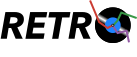

# Retro.jl



> [!WARNING]
> The optimizer is still under development, and has not been fully tested, yet. Use with caution.

Retro (REflective-bounds Trust-Region Optimizer): A high-performance Julia package for bound-constrained optimization using trust-region reflective methods.

## Features

- **Multiple Hessian Approximations**: BFGS, SR1, Exact Hessian, and Gauss-Newton
- **Flexible Subproblem Solvers**: 2D subspace, Conjugate Gradient, and full-space eigenvalue solvers
- **Bound Constraints**: Interior-point reflective method (Coleman-Li algorithm)
- **Automatic Differentiation**: Seamless integration via DifferentiationInterface
- **Least-Squares Support**: Specialized Gauss-Newton for residual formulations
- **Global Search with LHS**: Latin Hypercube Sampling for candidate generation in global optimization
  
## Quick Start

### Adding Retro to your project
1. Make a local copy of Retro on your machine and store it in a location that is easily accessible.
2. In your Julia project, run `pkg> develop <path/to/Retro.jl>`
3. Retro will be usable within your project.

### Using Retro

```julia
using Retro

# Simple unconstrained optimization
f(x) = sum(abs2, x .- [1.0, 2.0])
prob = RetroProblem(f, [0.0, 0.0], AutoForwardDiff())
result = optimize(prob)

# Bound-constrained optimization (Rosenbrock)
rosenbrock(x) = 100*(x[2] - x[1]^2)^2 + (1 - x[1])^2
prob = RetroProblem(rosenbrock, [-1.2, 1.0], AutoForwardDiff();
                   lb=[-2.0, -2.0], ub=[2.0, 2.0])
result = optimize(prob)

# Least-squares with Gauss-Newton (prob.f must be residual function!)
residuals(x) = [10*(x[2] - x[1]^2); 1 - x[1]]
prob = RetroProblem(residuals, [-1.2, 1.0], AutoForwardDiff())
result = optimize(prob, GaussNewtonUpdate())

# Change subspace
f(x) = sum(abs2, x .- [1.0, 2.0])
prob = RetroProblem(f, [0.0, 0.0], AutoForwardDiff())
result = optimize(prob, BFGSUpdate(), FullSpace())
```

## Hessian Strategies

- `BFGSUpdate()`: Quasi-Newton BFGS (default; recommended for general use)
- `SR1Update()`: Symmetric Rank-1 (good for indefinite problems)
- `ExactHessian()`: Exact Hessian via AD (expensive but accurate)
- `GaussNewtonUpdate()`: For least-squares (**requires `prob.f` to be residual function**)

## Subproblem Solvers

- `TwoDimSubspace()`: 2D subspace method (default; recommended, good balance)
- `CGSubspace()`: Steihaug-Toint CG (good for large problems)
- `FullSpace()`: Eigenvalue decomposition (most accurate, expensive)

## Important Notes

### Gauss-Newton Methods

When using `GaussNewtonUpdate()`, **`prob.f` must be the residual function** r(x) that returns a vector, not a scalar objective. The implicit objective being minimized is 0.5*||r(x)||².

```julia
# ✓ CORRECT: prob.f is the residual function
residuals(x) = [10*(x[2] - x[1]^2); 1 - x[1]]
prob = RetroProblem(residuals, x0, AutoForwardDiff())
optimize(prob, GaussNewtonUpdate(), TwoDimSubspace())

# ✗ WRONG: prob.f is a scalar objective
objective(x) = 100*(x[2] - x[1]^2)^2 + (1 - x[1])^2
prob = RetroProblem(objective, x0, AutoForwardDiff())
optimize(prob, GaussNewtonUpdate(), TwoDimSubspace())  # This will error!
```

## Acknowledgements
Retro.jl is heavily inspired by the [fides](https://github.com/fides-dev/fides) optimizer in Python and we wish to acknowledge the authors of the fides package for their contributions to the field of trust-region optimization. See the [fides paper](https://journals.plos.org/ploscompbiol/article?id=10.1371/journal.pcbi.1010322) for more details.
