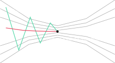

# 1 — The Simplest Optimizer

## The problem

Suppose you want to minimise a smooth function ``f : \mathbb{R}^n \to \mathbb{R}``.
The most obvious strategy is **gradient descent**: move in the direction that makes
``f`` decrease fastest.

```math
x_{k+1} = x_k  -  \alpha \nabla f(x_k)
```

where ``\alpha > 0`` is a step size.

### Why it breaks

Gradient descent is simple, but it has well-known failure modes:

* **Step-size dilemma** — too large and you overshoot; too small and you
  converge glacially.  The *optimal* ``\alpha`` depends on local curvature, which changes at every point.
* **Zig-zagging** — in narrow valleys (like the Rosenbrock function) the
  gradient is nearly perpendicular to the valley floor, so the iterates
  bounce back and forth making almost no progress.
* **No curvature information** — the gradient tells you *direction* but not *how far* the linear approximation is valid.

```@raw html
<div style="text-align: center;">
    
    <p style="font-size: 0.9em; color: #555;">Gradient descent zig-zagging in a narrow valley</p>
</div>
```

## The idea

What if we used **second-order** information (curvature) to build a better
local model of ``f``?  That is exactly what Newton's method does:

```math
f(x_k + p) \approx m_k(p) = f(x_k) + \nabla f_k^\top p + \tfrac12 p^\top H_k\, p
```

where ``H_k`` is the Hessian (or an approximation).  Minimising ``m_k`` gives
the **Newton step** ``p_N = -H_k^{-1}\, \nabla f_k``.

Newton converges quadratically near a solution — but it can diverge wildly if
``H_k`` is indefinite or the starting point is far from the minimum.

```@raw html
<div class="admonition is-warning">
<p class="admonition-title">Pitfall</p>
<p>Pure Newton's method has no global convergence guarantee.  A bad
Hessian or a large step can send you to infinity.</p>
</div>
```

## What Retro does

Retro **never** takes a raw Newton step.  Instead, it wraps the quadratic
model in a **trust region** — a ball of radius ``\Delta`` around the current
point where we trust the model to be accurate.

That is the subject of the [next chapter](trust-region.md).

---

*Next → [Adding Trust Regions](trust-region.md)*
